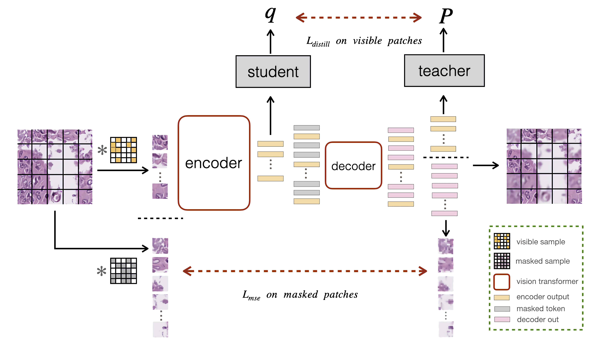

# PyTorch implementation of [Self-distillation Augmented Masked Autoencoders for Histopathological Image Understanding](https://arxiv.org/abs/2203.16983)

<div align="center">
  
</div>

## Pretrained models
<table>
  <tr>
    <th>arch</th>
    <th>params</th>
    <th colspan="4">download</th>
  </tr>
  <tr>
    <td>ViT-S/16</td>
    <td>21M</td>
    <td><a href="https://drive.google.com/file/d/1HG-qhstOgPknRo_tix0UwnjN3qq3A7R4/view?usp=drive_link">NCT-CRC' model</a></td>
    <td><a href="https://drive.google.com/file/d/1fEceKKzaia9YF5z6Oz5SdiWL47GI0cxa/view?usp=drive_link">NCT-CRC' logs</a></td>
    <td><a href="https://drive.google.com/file/d/1mzGjbWp2O1YNdwwWUoUIYZDA2SYR8OZ2/view?usp=drive_link">PCam's model</a></td>
    <td><a href="https://drive.google.com/file/d/1ElaRwbuhSH1h7bEEPRKyLn7IY9JdUBtY/view?usp=drive_link">PCam's logs</a></td>
  </tr>
</table>


## Training
Please install [PyTorch](https://pytorch.org/) and download the [NCT-CRC-HE](https://zenodo.org/records/1214456) and [PatchCamelyon](https://patchcamelyon.grand-challenge.org) dataset. This codebase has been developed based on [MAE](https://github.com/pengzhiliang/MAE-pytorch). More information about requirements can be found at it. 


###  Single-node training on PatchCamelyon dataset
Run SD-MAE with ViT-small classing model on a single node with 4 GPUs for 100 epochs with the following command. We provide [training](https://drive.google.com/file/d/1fEceKKzaia9YF5z6Oz5SdiWL47GI0cxa/view?usp=drive_link) logs for this run to help reproducibility.
```
python -m torch.distributed.launch --nproc_per_node=4  SD-MAE/run_mae_pretraining.py  \
    --data_path yourpath/pCam \
    --batch_size 256 \
    --model ltrp_base_and_vs \
    --mask_ratio 0.6 \
    --epochs 100 \
    --dino_head_dim 4096 \
    --dino_bottleneck_dim 256 \
    --dino_hidden_dim 2048 \
    --warmup_epochs 5 \ 
    --lr 0.0006
```

###  Single-node finetuning on PatchCamelyon dataset
```
python -m torch.distributed.launch --nproc_per_node=4  SD-MAE/run_class_finetuning.py \
    --model vit_small_patch16_224 \
    --finetune yourpath/checkpoint-100.pth \
    --data_path  yourpath/pCam \
    --batch_size 256 \
    --opt adamw \
    --opt_betas 0.9 0.999 \
    --weight_decay 0.05 \
    --epochs 100 \
    --nb_classes 2
    --data_set 'pCam' \
    --lr 0.001

```

